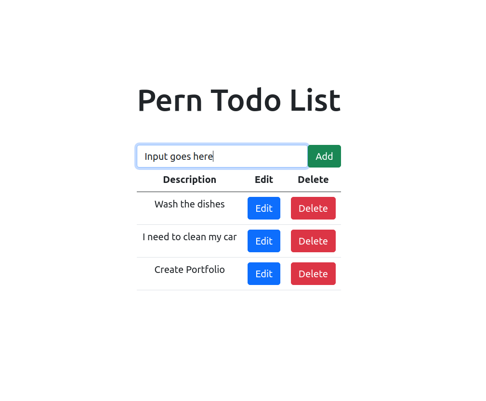

# To-Do Application Created With the Pern Stack

# What I Learned

This project was my first full stack application. I built a Restful API that used CRUD operations to manipulate data in a PostgreSQL database. The UI is dynamically rendered using the data found in the Database table.

# Technologies used

### Vite, JSX, CSS, Bootstrap, Javascript/React, Nodemon, Cors, Express, Node.js, Postman, Postgres, PgAdmin

# 1 Server

I setup a server using the Express library and ran it on local port 5000. Changes were monitored using Nodemon.

# 2 Database

I created a database and table using Postgres and pgAdmin 4.

# 3 Routes and Queries

I built routes with PostgreSQL Queries to perfrom CRUD operations on the server and manipulate data in the Postgres Database. I utilized Postman to test my fetch requests.

# 4 Middleware

I used CORS to allow the client to make requests to the server.

# 4 Frontend/UI

I constructed the Frontend with React Components and Bootstrap 5. Event listeners will trigger upon user input to send requests to the server. The UI is then dynamically updated and rendered after receiving the response.
